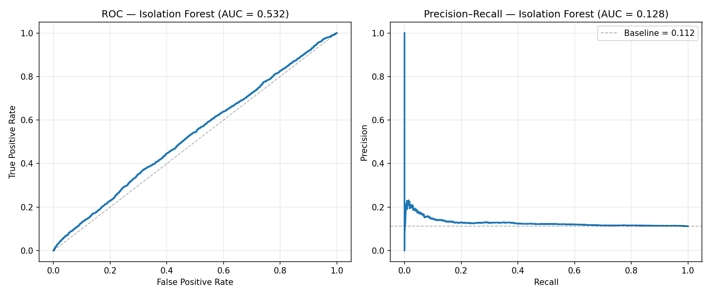
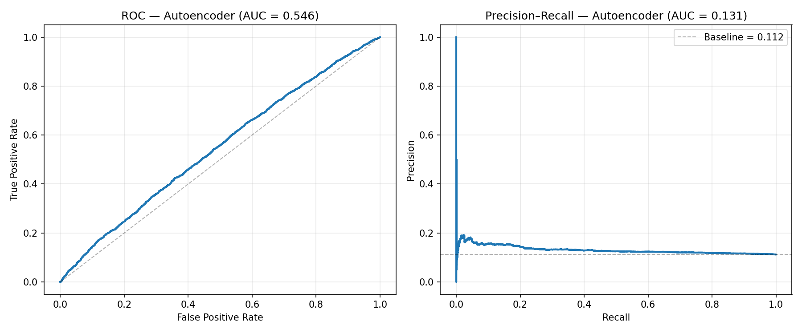

# Ontology-aware Anomaly Detection Toy Pipeline

This repository contains a **toy but engineering-grade** implementation of an ontology-aware anomaly detection pipeline for hospital readmission risk, built on top of the **"Diabetes 130-US hospitals"** dataset (UCI Machine Learning Repository).

The goal is to simulate, in a simplified setting, the kind of pipeline we would eventually deploy on ICU/EHR data with ontology-aware scoring and explainability.

---

## 1. Problem Definition

### Task

We work with de-identified inpatient encounters of diabetic patients and define a **binary prediction / anomaly detection** task:

> **Target:** early hospital readmission within 30 days  
> **Formally:**
> - `y = 1` if `readmitted == '<30'`  
> - `y = 0` if `readmitted in {'NO', '>30'}`

From an anomaly detection perspective, **early readmissions (`y=1`)** are treated as *rare / high-risk events* compared to the majority of encounters (`y=0`).

### Why anomaly detection?

Instead of pure supervised classification, we treat positive cases as "rare events" and:

- train the models primarily on **normal (y=0)** samples  
- then score all encounters by how "abnormal" they look

This mimics the setup in more realistic ICU anomaly detection scenarios where true labels are sparse and costly.

---

## 2. Dataset

We use the UCI dataset:

> **Diabetes 130-US hospitals for years 1999–2008**  
> ~100k encounters, adults with diabetes, including demographics, admission/discharge info, medications, and lab counts.

After basic cleaning and feature selection, we keep a small but clinically interpretable feature set (e.g., demographics + admission type + lab/medication counts + readmission history + medication change).

### Final sample statistics

After preprocessing:

- **Total samples:** 99,493  
- **Positive class (`y=1`, readmitted <30 days):** 11,169 (11.2%)  
- **Negative class (`y=0`):** 88,324 (88.8%)

The **class imbalance** is moderate but still realistically skewed towards non-readmissions.

---

## 3. Target Definition (Research-grade)

We enforce a strict, explicit target definition in code:

```python
# in src/preprocessing.py

def create_target(df: pd.DataFrame) -> Tuple[pd.DataFrame, pd.Series]:
    """
    Target definition:
        y = 1  if readmitted == '<30'
        y = 0  if readmitted in {'NO', '>30'}
    """
    valid_categories = {'<30', '>30', 'NO'}
    observed = set(df['readmitted'].unique())
    unknown = observed - valid_categories
    if unknown:
        raise ValueError(
            f"Unexpected 'readmitted' categories found: {sorted(unknown)}; "
            f"expected only {sorted(valid_categories)}"
        )

    mapping = {'<30': 1, '>30': 0, 'NO': 0}
    y = df['readmitted'].map(mapping).astype(int)
    X = df.drop(columns=['readmitted'])
    return X, y
```

This makes the prediction target fully reproducible and auditable, which is essential for any clinical ML narrative.

---

## 4. Pipeline Overview

The end-to-end pipeline is implemented in `run_pipeline_direct.py` and consists of:

### Preprocessing & EDA

- Load raw CSV: `data/raw/diabetic_data.csv`
- Replace '?' with NaN
- Drop rows with missing values in a small set of critical clinical columns
- Impute remaining missing values:
  - numerical: median
  - categorical: "Unknown"
- One-hot encode categorical variables
- Standardize numerical features
- Log a full data filtering summary to:
  - `results/reports/data_filtering_summary.json`
  - `results/reports/data_filtering_summary.md`

### Baseline Isolation Forest (IF)

- Train **only on normal samples (y=0)**
- Use contamination rate equal to the positive rate in the train set
- Evaluate on test set using:
  - ROC-AUC
  - PR-AUC
  - Precision/Recall at 90th / 95th / 99th score percentiles

### Autoencoder (AE)

- Simple fully-connected autoencoder with:
  - hidden dims: [128, 64, 32]
  - epochs: 50
  - batch size: 256
  - learning rate: 1e-3
- Train **only on normal samples (y=0)**
- Use reconstruction error as anomaly score
- Same evaluation metrics as IF

### Ontology Layer

- Apply a small set of hand-crafted diabetes rules on a clinical feature subset:
  - `poor_control_no_med_change`
  - `high_glucose_short_stay`
  - `frequent_inpatient_admissions`
  - `polypharmacy`
  - `er_and_inpatient_use`
- Each rule fires a penalty when clinically suspicious patterns appear.
- Combine ML scores + ontology penalties:
  
  **score_final = α · score_IF + β · penalty_ontology**
  
  with β = λ, α = 1 − λ.

- Perform a small λ-sweep:
  - λ ∈ {0.00, 0.10, 0.30, 0.50}
- Pick best λ by PR-AUC (ROC-AUC as tie-breaker)
- Log rule-level statistics:
  - how many times each rule fired
  - how many of those were truly positive (y=1)
  - precision per rule

### Multi-split Evaluation

- Repeat the whole experiment for multiple random seeds:
  - `random_state ∈ {42, 123, 456, 789, 2025}`
- For each seed, record:
  - IF ROC/PR AUC
  - AE ROC/PR AUC
  - IF+Ontology ROC/PR AUC and best λ*
- Save an aggregate summary to:
  - `results/reports/multi_split_metrics.json`
  - `results/reports/multi_split_metrics.md`

---

## 5. Installation & Setup

### 5.1. Create and activate environment

```bash
# Create a new conda environment
conda create -n anomaly python=3.11 -y

# Activate the environment
conda activate anomaly

# Install dependencies
pip install -r requirements.txt
```

### 5.2. Data

Place the UCI dataset here:

```
data/
  raw/
    diabetic_data.csv
```

File name is expected to be exactly:

```
data/raw/diabetic_data.csv
```

---

## 6. How to Run the Pipeline

```bash
# From the project root:
conda activate anomaly

# Run the entire end-to-end pipeline
python run_pipeline_direct.py
```

This will:

- Print a detailed step-by-step log to the console
- Generate:
  - ROC/PR figures under `results/figures/`
  - Data filtering report under `results/reports/`
  - Multi-split metrics under `results/reports/`

### 6.1. Running Tests

To verify that preprocessing, models, and ontology rules behave as expected:

```bash
conda activate anomaly
pytest -q
```

You should see something like:

```
6 passed in 1.14s
```

---

## 7. Example Figures (ROC / PR Curves)

The script generates three key plots:

- `results/figures/if_roc_pr.png` – Isolation Forest
- `results/figures/ae_roc_pr.png` – Autoencoder
- `results/figures/ontology_roc_pr.png` – IF + Ontology (best λ)

You can embed example figures in a report or notebook as:

```markdown





```

### Quick interpretation

- **Isolation Forest** provides a basic unsupervised anomaly baseline.
- **Autoencoder** consistently outperforms IF on PR-AUC, capturing more subtle structure.
- **IF + Ontology** achieves the best and most stable performance across seeds:
  - higher ROC-AUC
  - consistently higher PR-AUC
  - improved precision at high-risk percentiles (90th, 95th, 99th)

This shows that even a simple ontology layer can add useful signal on top of standard ML models.

---

## 8. Quantitative Results (Multi-split)

We run the pipeline over 5 different random splits (`random_state ∈ {42, 123, 456, 789, 2025}`) and report mean ± std:

| Model            | ROC-AUC (mean ± std) | PR-AUC (mean ± std) |
|------------------|----------------------|---------------------|
| Isolation Forest | 0.5294 ± 0.0056      | 0.1265 ± 0.0021     |
| Autoencoder      | 0.5557 ± 0.0179      | 0.1358 ± 0.0109     |
| IF + Ontology    | 0.5824 ± 0.0041      | 0.1535 ± 0.0027     |

### Key observations:

- **AE > IF** on average, but with higher variance.
- **IF + Ontology**:
  - improves both ROC-AUC and PR-AUC over IF and AE
  - has low variance, indicating stable gains across different train/test splits.

These numbers are logged programmatically in:

- `results/reports/multi_split_metrics.json`
- `results/reports/multi_split_metrics.md`

---

## 9. Limitations

This is intentionally a toy pipeline; major limitations include:

### Single UCI dataset

All experiments are currently based on the Diabetes UCI dataset, which is:

- non-temporal (no full trajectories)
- limited in clinical richness compared to ICU datasets like MIMIC, eICU, or HiRID

### Simplified target

- Readmission <30 vs {NO, >30} is a crude proxy for adverse events.
- No direct modeling of specific complications, mortality, or treatment failure.

### No temporal modeling (yet)

- We work with aggregated / static features (e.g., counts of lab procedures, number of admissions).
- Real-world ontology-aware anomaly detection on EHR/ICU data must operate on time series and event sequences.

### Lightweight ontology

- The current ontology layer is a set of hand-crafted rules, not a full SNOMED / RxNorm / ICD ontology graph.
- Rules are inspired by clinical intuition (e.g., polypharmacy, frequent admissions) but not validated by clinicians.

### Calibration & decision thresholds

- We focus on ranking metrics (ROC/PR AUC) and percentile-based analysis.
- No full cost-sensitive or clinically-calibrated decision process is implemented yet.

---

## 10. Roadmap and Extensions

This toy pipeline is designed as a stepping stone towards a research-grade system for ICU/EHR data. Natural extensions include:

### Temporal & sequence modeling

- Move from static features to visit trajectories and time-stamped labs/medications.
- Integrate RNNs / Transformers / diffusion models for longitudinal anomaly detection.

### Richer ontology integration

- Replace hand-crafted rules with:
  - SNOMED / ICD graphs
  - medication ontologies (e.g., RxNorm)
- Use ontology distance / constraints in the anomaly scoring function.

### Multi-dataset evaluation

- Port the same pipeline to:
  - synthetic EHR datasets (e.g., Synthea)
  - open-access real-world datasets where possible
- Compare robustness and transferability of ontology-aware scoring.

### Explainability & counterfactuals

- Add local explanations for each flagged anomaly:
  - which rules fired
  - which features contributed most to AE reconstruction error
- Explore counterfactual suggestions (e.g., minimal change to meds that would drop anomaly score).

---

## 11. Running Everything in One Go

For quick reference, a typical workflow:

```bash
# 1. Setup
conda create -n anomaly python=3.11 -y
conda activate anomaly
pip install -r requirements.txt

# 2. Place data
#   data/raw/diabetic_data.csv

# 3. Run full pipeline
python run_pipeline_direct.py

# 4. Run tests
pytest -q
```

All results and logs will be written under `results/`:

- `results/figures/` – ROC/PR curves
- `results/reports/` – filtering summary, multi-split metrics, ontology rule stats

---

## 12. Experiment Log

For a more detailed, per-experiment record (seeds, λ values, etc.), see [EXPERIMENT_LOG.md](EXPERIMENT_LOG.md) in the repository.
