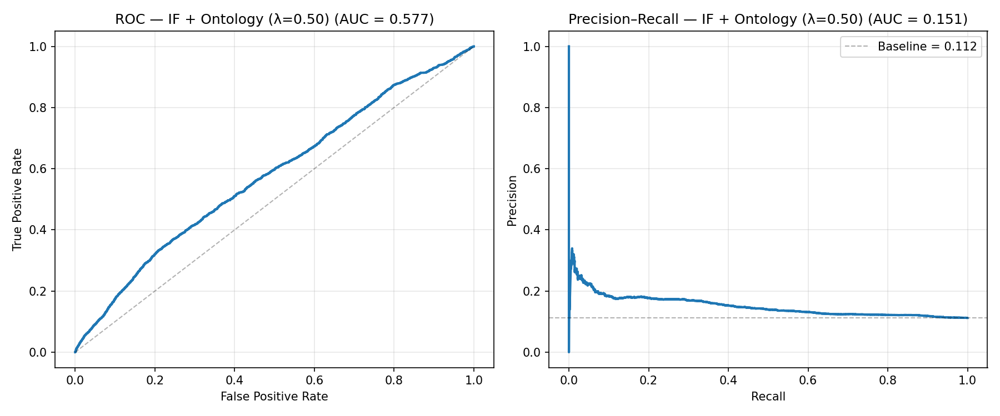
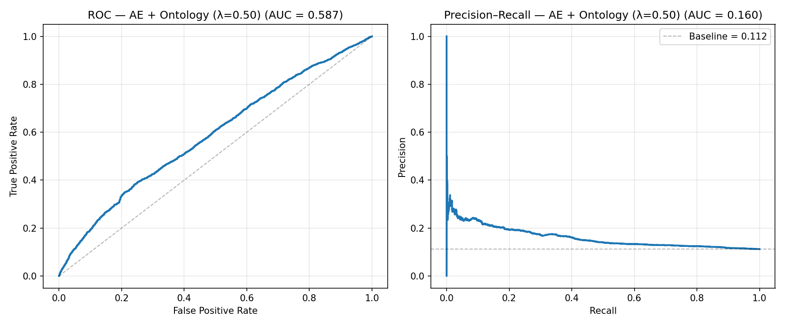

# Ontology-aware Anomaly Detection Toy Pipeline

This repository contains a **toy but engineering-grade** implementation of an ontology-aware anomaly detection pipeline for hospital readmission risk, built on top of the **"Diabetes 130-US hospitals"** dataset (UCI Machine Learning Repository).

The goal is to simulate, in a simplified setting, the kind of pipeline we would eventually deploy on ICU/EHR data with ontology-aware scoring and explainability.

---

## 1. Problem Definition

### Task

We work with de-identified inpatient encounters of diabetic patients and define a **binary prediction / anomaly detection** task:

> **Target:** early hospital readmission within 30 days  
> **Formally:**
> - `y = 1` if `readmitted == '<30'`  
> - `y = 0` if `readmitted in {'NO', '>30'}`

From an anomaly detection perspective, **early readmissions (`y=1`)** are treated as *rare / high-risk events* compared to the majority of encounters (`y=0`).

### Why anomaly detection?

Instead of pure supervised classification, we treat positive cases as “rare events” and:

- train the models primarily on **normal (y=0)** samples  
- then score all encounters by how “abnormal” they look

This mimics the setup in more realistic ICU anomaly detection scenarios where true labels are sparse and costly.

---

## 2. Dataset

We use the UCI dataset:

> **Diabetes 130-US hospitals for years 1999–2008**  
> ~100k encounters, adults with diabetes, including demographics, admission/discharge information, medications, and simple lab/procedure counts.

After basic cleaning and feature selection, we keep a small but clinically interpretable feature set (demographics, length of stay, lab/medication counts, utilisation history, medication change / diabetes meds).

### Final sample statistics

After preprocessing:

- **Total samples:** 99,493  
- **Positive class (`y=1`, readmitted \< 30 days):** 11,169 (11.2%)  
- **Negative class (`y=0`):** 88,324 (88.8%)

The **class imbalance** is moderate but still realistically skewed towards non-readmissions.

---

## 3. Target Definition (Research-grade)

We enforce a strict, explicit target definition in code:

```python
# in src/preprocessing.py

def create_target(df: pd.DataFrame) -> Tuple[pd.DataFrame, pd.Series]:
    """
    Target definition:
        y = 1  if readmitted == '<30'
        y = 0  if readmitted in {'NO', '>30'}
    """
    valid_categories = {'<30', '>30', 'NO'}
    observed = set(df['readmitted'].unique())
    unknown = observed - valid_categories
    if unknown:
        raise ValueError(
            f"Unexpected 'readmitted' categories found: {sorted(unknown)}; "
            f"expected only {sorted(valid_categories)}"
        )

    mapping = {'<30': 1, '>30': 0, 'NO': 0}
    y = df['readmitted'].map(mapping).astype(int)
    X = df.drop(columns=['readmitted'])
    return X, y
```
This makes the prediction target fully reproducible and auditable, which is essential for any clinical ML narrative.

## 4. Pipeline Overview
The end-to-end pipeline is implemented in `run_pipeline_direct.py` and consists of:

### 4.1. Preprocessing & EDA
- Load raw CSV: `data/raw/diabetic_data.csv`
- Replace '?' with NaN
- Drop rows with missing values in a small set of critical clinical columns (e.g. target + key features)
- Impute remaining missing values:
  - numerical: median
  - categorical: "Unknown"
- One-hot encode categorical variables
- Standardize numerical features
- Track all filtering steps and class balance via `FilterTracker`
- Log a full data filtering summary to:
  - `results/reports/data_filtering_summary.json`
  - `results/reports/data_filtering_summary.md`

### 4.2. Baseline Isolation Forest (IF)
- Train only on normal samples (`y=0`) to mimic unsupervised anomaly detection
- Use contamination rate equal to the positive rate in the train set (unless overridden)
- Evaluate on the held-out test set using:
  - ROC-AUC
  - PR-AUC
  - (optionally) precision/recall at high-risk score percentiles

### 4.3. Autoencoder (AE)
- Simple fully-connected autoencoder with:
  - hidden dims: `[128, 64, 32]`
  - epochs: 50
  - batch size: 256
  - learning rate: 1e-3
- Train only on normal samples (`y=0`)
- Use reconstruction error as anomaly score
- Same evaluation metrics as IF

### 4.4. Supervised Baselines
For comparison with anomaly-style models, we also include:
- **Decision Tree** (`DecisionTreeDetector`)
- **Random Forest** (`RandomForestDetector`)

Each model:
- is trained on full `(X_train, y_train)`
- outputs `P(y=1 | x)` as a risk / anomaly score
- is evaluated with ROC-AUC and PR-AUC

### 4.5. Ontology Layer
We apply a small set of hand-crafted diabetes-inspired rules on a clinical feature subset:
- `poor_control_no_med_change`
- `high_glucose_short_stay`
- `frequent_inpatient_admissions`
- `polypharmacy`
- `er_and_inpatient_use`

Each rule fires a penalty when clinically suspicious patterns appear (see `src/ontology.py`).

We then combine ML scores and ontology penalties:
```math
score_{final} = \alpha \cdot score_{ML} + \beta \cdot penalty_{ontology}
```
with $\beta = \lambda, \alpha = 1 - \lambda$.

Concretely:
1. Perform a small $\lambda$-sweep:
   $\lambda \in \{0.00, 0.10, 0.30, 0.50\}$
2. For each $\lambda$:
   - compute IF+Ontology scores
   - compute AE+Ontology scores
3. Select the best $\lambda$ using:
   - **PR-AUC** as the main criterion
   - ROC-AUC as tie-breaker
4. Construct an ontology-aware ensemble:
   $0.5 \cdot (IF+Ont) + 0.5 \cdot (AE+Ont)$

We also log rule-level statistics:
- how many times each rule fired
- how many of those were truly positive (`y=1`)
- per-rule precision

### 4.6. Multi-split Evaluation
We repeat the experiment across multiple random seeds:
`random_state` $\in \{42, 123, 456, 789, 2025\}$

For each seed, we record:
- IF ROC/PR-AUC
- AE ROC/PR-AUC
- IF+Ontology ROC/PR-AUC and best $\lambda^*$

The aggregate summary is saved to:
- `results/reports/multi_split_metrics.json`
- `results/reports/multi_split_metrics.md`

## 5. Installation & Setup
### 5.1. Create and activate environment
Using conda (recommended):

```bash
# Create a new environment
conda create -n anomaly python=3.11 -y

# Activate the environment
conda activate anomaly

# Install dependencies
pip install -r requirements.txt
```
You can also use `python -m venv venv` and `setup_project.py` if you prefer a plain virtualenv workflow.

### 5.2. Data
Place the UCI dataset here:
```
data/
  raw/
    diabetic_data.csv
```
The expected file path is:
```text
data/raw/diabetic_data.csv
```

## 6. How to Run the Pipeline
From the project root:

```bash
conda activate anomaly

# Run the entire end-to-end pipeline
python run_pipeline_direct.py
```

This will:
1. send a detailed step-by-step log to the console and `results/logs/pipeline.log`
2. generate:
   - ROC/PR figures under `results/figures/`
   - data filtering report under `results/reports/`
   - multi-split metrics under `results/reports/`

### 6.1. Running Tests
If you have tests configured:

```bash
conda activate anomaly
pytest -q
```
Expected output (example):
```text
6 passed in 1.14s
```

## 7. Example Figures (ROC / PR Curves)
The script generates several key plots (filenames may vary slightly depending on configuration):
- `results/figures/if_roc_pr.png` – Isolation Forest
- `results/figures/ae_roc_pr.png` – Autoencoder
- `results/figures/ontology_if_roc_pr.png` – IF + Ontology (best $\lambda$)
- `results/figures/ontology_ae_roc_pr.png` – AE + Ontology (best $\lambda$)
- `results/figures/ontology_ensemble_roc_pr.png` – Ontology-aware ensemble

You can embed them in a report or notebook as:

```markdown







```

### Quick interpretation
- **Isolation Forest** provides a basic unsupervised anomaly baseline.
- **Autoencoder** typically outperforms IF on PR-AUC, capturing more subtle structure.
- **IF + Ontology** and **AE + Ontology** push the frontier further by injecting simple clinical rules.
- The **ontology-aware ensemble** tends to be the most stable option across random seeds.
- Even a small ontology layer adds useful signal on top of standard ML anomaly models.

## 8. Quantitative Results (Multi-split)
Over 5 different random splits (`random_state` $\in \{42, 123, 456, 789, 2025\}$), we report mean ± std:

| Model | ROC-AUC (mean ± std) | PR-AUC (mean ± std) |
| :--- | :--- | :--- |
| **Isolation Forest** | 0.5294 ± 0.0056 | 0.1265 ± 0.0021 |
| **Autoencoder** | 0.5557 ± 0.0179 | 0.1358 ± 0.0109 |
| **IF + Ontology** | **0.5824 ± 0.0041** | **0.1535 ± 0.0027** |

### Key observations
- **AE > IF** on average, but with higher variance.
- **IF + Ontology**:
  - improves both ROC-AUC and PR-AUC over IF and AE
  - has relatively low variance, indicating stable gains across different train/test splits.

These numbers are logged programmatically in:
- `results/reports/multi_split_metrics.json`
- `results/reports/multi_split_metrics.md`

## 9. Limitations
This is intentionally a toy pipeline; major limitations include:

1. **Single UCI dataset**
   - All experiments are currently based on the Diabetes UCI dataset, which is:
     - non-temporal (no visit-level time series)
     - limited in clinical richness compared to ICU datasets like MIMIC, eICU, or HiRID

2. **Simplified target**
   - Readmission <30 vs {NO, >30} is a crude proxy for “adverse event”.
   - We do not model specific complications, mortality, or treatment failure.

3. **No temporal modeling (yet)**
   - We work with aggregated / static features (e.g. counts of lab procedures, number of admissions).
   - Real-world ontology-aware anomaly detection on ICU/EHR data should operate on time series and event sequences.

4. **Lightweight ontology**
   - The current ontology layer is a set of hand-crafted rules, not a full SNOMED / RxNorm / ICD ontology graph.
   - Rules are inspired by clinical intuition (e.g. polypharmacy, frequent admissions) but have not been validated by clinicians.

5. **Calibration & decision thresholds**
   - We focus on ranking metrics (ROC/PR-AUC) and percentile-based analysis.
   - We do not yet implement a full cost-sensitive or clinically calibrated decision policy.

## 10. Roadmap and Extensions
This toy pipeline is designed as a stepping stone towards a research-grade system for ICU/EHR data. Natural extensions include:

- **Temporal & sequence modeling**
  - Move from static features to visit trajectories and time-stamped labs/medications.
  - Integrate RNNs / Transformers / diffusion models for longitudinal anomaly detection.

- **Richer ontology integration**
  - Replace hand-crafted rules with:
    - SNOMED / ICD graphs
    - medication ontologies (e.g. RxNorm)
  - Incorporate ontology distance / constraints directly into anomaly scoring.

- **Multi-dataset evaluation**
  - Port the same pipeline to:
    - synthetic EHR datasets (e.g. Synthea)
    - open-access real-world datasets where possible
  - Compare robustness and transferability of ontology-aware scoring.

- **Explainability & counterfactuals**
  - Add local explanations for each flagged anomaly:
    - which rules fired
    - which features contributed most to AE reconstruction error
  - Explore counterfactual suggestions (e.g. minimal changes to meds that would drop the anomaly score).

## 11. Running Everything in One Go
Typical end-to-end workflow:

```bash
# 1. Setup
conda create -n anomaly python=3.11 -y
conda activate anomaly
pip install -r requirements.txt

# 2. Place data
#   data/raw/diabetic_data.csv

# 3. Run full pipeline
python run_pipeline_direct.py

# 4. (Optional) Run tests
pytest -q
```

All results and logs will be written under `results/`:
- `results/figures/` – ROC/PR curves
- `results/reports/` – filtering summary, multi-split metrics, ontology rule stats
- `results/logs/` – pipeline logs

## 12. Experiment Log
For a more detailed, per-experiment record (seeds, $\lambda$ values, etc.), see `EXPERIMENT_LOG.md` in the repository.
